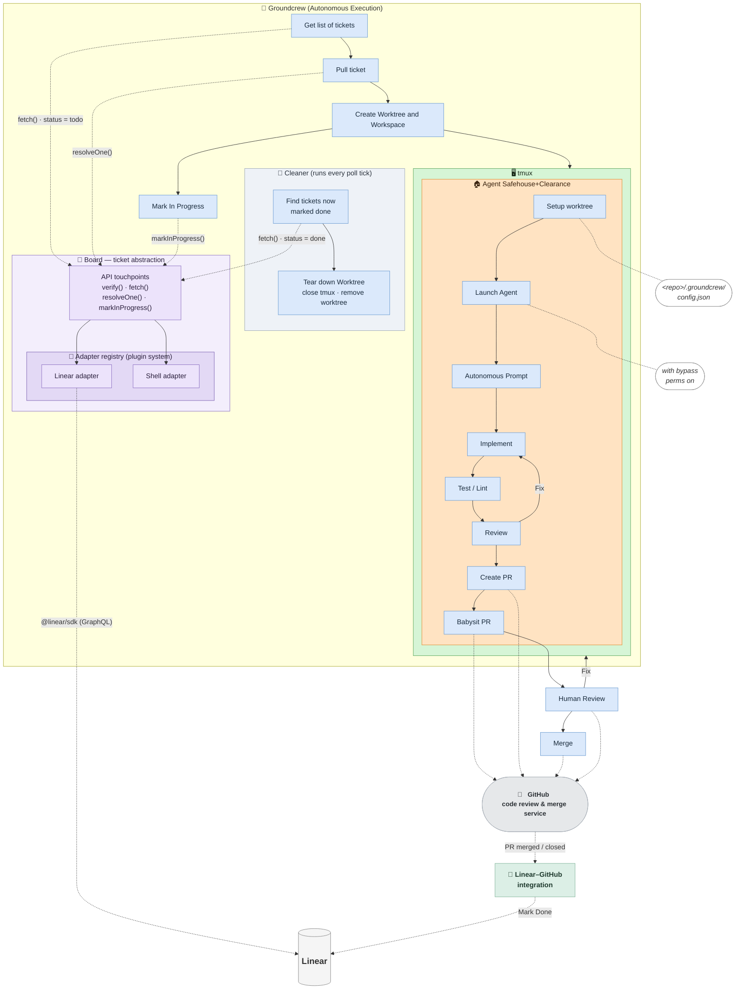

# Groundcrew — Autonomous Execution

The autonomous-execution phase of the [SDLC workflow](./sdlc-workflow.md). Groundcrew
polls a ticket system, runs an agent per ticket inside an isolated sandbox, opens a PR,
and tears the worktree down once the ticket is marked done.

