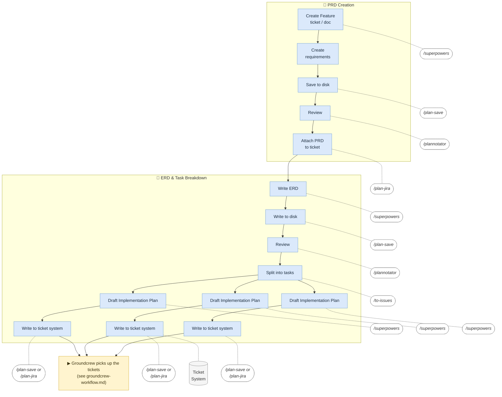

# SDLC Workflow

Planning phases (PRD + ERD/task breakdown). Once tasks are written to the ticket
system, the autonomous-execution phase is documented separately in
[Groundcrew — Autonomous Execution](./groundcrew-workflow.md).

