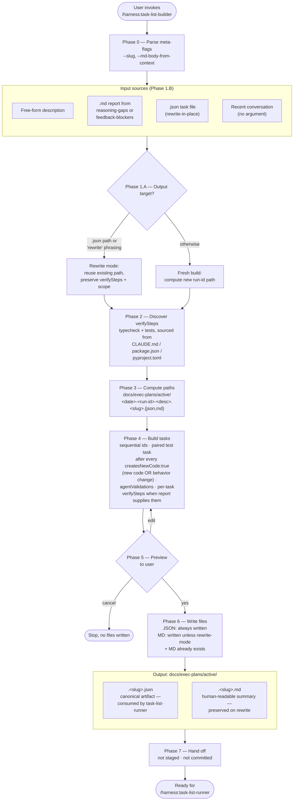

# task-list-builder

Build or rewrite a paired `.json` + `.md` task list in the harness task-list-schema format.

The full instructions Claude follows when this skill runs are in [`SKILL.md`](./SKILL.md). This README is a pointer for people browsing the repo.

## Invoke

```text
/harness:task-list-builder [free-form description | path to .md report | path to .json task file (rewrite) | empty for conversation context]
```

Pairs with [`task-list-runner`](../task-list-runner/), which consumes the JSON the builder produces.

## What it does

Turns one of these inputs into a paired task list under `docs/exec-plans/active/`:

- a free-form description of work
- a `/harness:reasoning-gaps` or `/harness:feedback-blockers` report (`.md`)
- an existing `.json` task file (rewrite-in-place)
- recent conversation context (when no argument is given)

Output is always two files: a `.<slug>.json` (machine-readable, the runner's input) and a paired `.<slug>.md` (human-readable summary). The default slug is `task-list-builder`; callers can override it with `--slug <name>` to preserve provenance (e.g., `/harness:feedback-blockers` passes `--slug feedback-blockers` so its output files are clearly distinguishable).

## How it works



## Schema

The JSON schema is defined once, in [`../../task-list-schema.md`](../../task-list-schema.md). Both `task-list-builder` and `task-list-runner` read from that file rather than duplicating it.

See [`example.json`](./example.json) for a minimal valid task file.

## Files in this directory

| File           | Purpose                                                     |
| -------------- | ----------------------------------------------------------- |
| `SKILL.md`     | Instructions Claude executes when the skill is invoked      |
| `example.json` | Reference task file used by `SKILL.md` to anchor the schema |

## Install

The skill ships with the `harness` plugin:

```text
/plugin install harness@wild-horses
```
