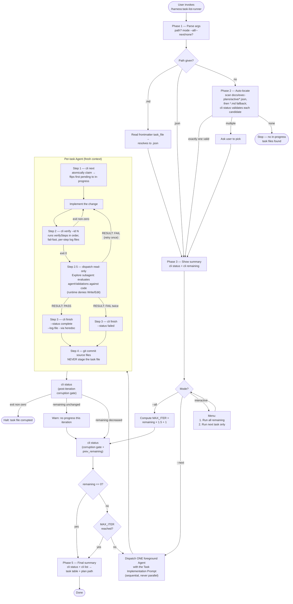

# task-list-runner

Drive a harness task list (a JSON file in the task-list-schema format) to completion by dispatching each task to a foreground `Agent` call, one at a time.

The full instructions Claude follows when this skill runs are in [`SKILL.md`](./SKILL.md). This README is a pointer for people browsing the repo.

## Invoke

```text
/harness:task-list-runner [path to .json or .md task file] [--all | --next]
```

With no path, the runner auto-locates an in-progress task file under `docs/exec-plans/active/`.

Pairs with [`task-list-builder`](../task-list-builder/), which produces the JSON the runner consumes.

## What it does

For each `pending` / `in-progress` task in the file:

1. Dispatch a fresh foreground `Agent` with the Task Implementation Prompt.
2. The agent claims the task (`task_list_cli.py next`), implements the change, and runs `verifySteps` (typecheck, tests, etc.) via `task_list_cli.py verify` from inside its own run.
3. The agent dispatches a fresh-context validation subagent to evaluate `agentValidations` against the post-change code.
4. The agent marks the task `complete` or `failed` via `task_list_cli.py finish`, writing its report to the `log` field. The runner re-checks `status` as a corruption gate before the next iteration.

Modes: `--all` (run every remaining task non-interactively), `--next` (one task then stop), no flag (interactive menu).

## How it works



All mutations to the JSON go through `task_list_cli.py`. The CLI is auto-approved by the harness `PreToolUse` hook so the loop runs without per-call permission prompts; every subcommand calls `load_and_validate` first, which is what makes the corruption-gate `status` calls between iterations meaningful.

## The bundled CLI

`task_list_cli.py` is the canonical interface to the task JSON — the runner and dispatched agents never edit the file directly. Subcommands: `next`, `start`, `finish`, `get`, `list`, `status`, `remaining`, `verify`. See the "CLI reference" section of [`SKILL.md`](./SKILL.md) for the full surface.

The harness plugin's PreToolUse hook auto-approves invocations of this CLI so the loop runs without per-call permission prompts.

## Schema

The JSON schema is defined once, in [`../../task-list-schema.md`](../../task-list-schema.md). Both `task-list-runner` and `task-list-builder` read from that file rather than duplicating it.

## Files in this directory

| File                    | Purpose                                                     |
| ----------------------- | ----------------------------------------------------------- |
| `SKILL.md`              | Instructions Claude executes when the skill is invoked      |
| `task_list_cli.py`      | Bundled CLI — the only sanctioned mutator for the task JSON |
| `test_task_list_cli.py` | Pytest suite for the CLI                                    |

Run the tests from the repo root:

```text
uv run pytest plugins/harness/skills/task-list-runner/test_task_list_cli.py
```

## Install

The skill ships with the `harness` plugin:

```text
/plugin install harness@wild-horses
```
